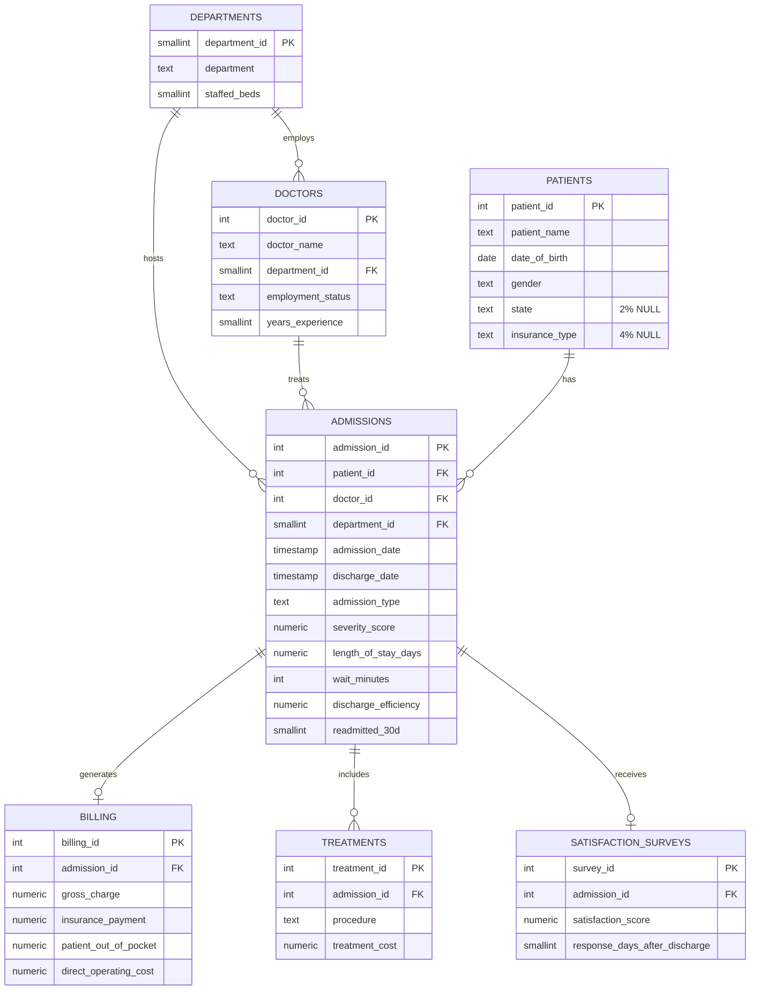

# Data Model — Hospital Operations Analytics

Star-schema layout: `admissions` is the central fact table. Rendered natively by
GitHub — no image export needed.

The diagram reflects the intended relational model. The local SQLite mirror is built
from the canonical cleaned admissions CSV plus raw supporting extracts; its CSV key
relationships are checked by `scripts/validate_project.py`.

**Why this shape:** `admissions` is deliberately the hub, not `patients`, because
the unit of analysis for every operational question in this project (LOS, wait time,
readmission, discharge efficiency) is a single hospital stay, not a person. A patient
with 4 admissions across the 3-year window contributes 4 independent rows to every
downstream query — which is the correct behavior for operational analytics, but worth
stating explicitly since it's a modeling decision, not a default.
